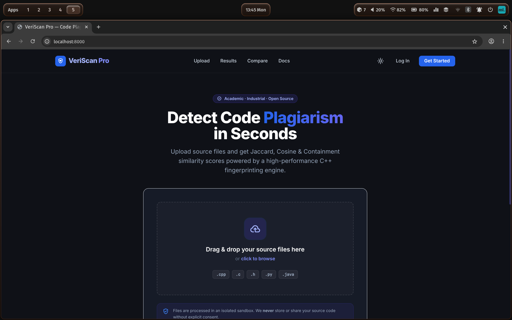
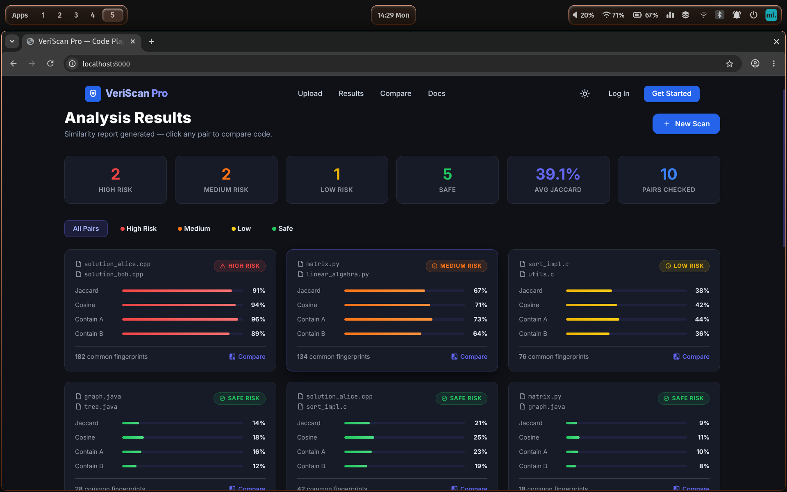

# VeriScan Pro — Code Plagiarism Detection

<div align="center">

**A high-performance, full-stack code plagiarism detection system** with both CLI and modern web interface.

[](https://isocpp.org/) [](https://developer.mozilla.org/en-US/docs/Web/JavaScript) [](LICENSE) []()

</div>

---

##  Overview

**VeriScan Pro** is an institutional-grade source code plagiarism detection system designed for academic and professional use. It provides both a powerful command-line tool and a modern web-based interface (localhost) for detecting code similarities using advanced fingerprinting and machine learning-inspired techniques.

The system analyzes pairs of source files using multiple similarity metrics (Jaccard, Cosine, Containment) and generates comprehensive reports with risk assessment, visual comparisons, and detailed match statistics.

### Key Highlights

-  **Lightning Fast**: LSH-optimized comparisons handle thousands of files efficiently
-  **Multi-Metric Analysis**: Jaccard, Cosine, and Containment similarity scores
-  **Modern UI**: Professional web interface with dark mode and real-time filtering
-  **Risk Assessment**: Automatic categorization of matches (High/Medium/Low/Safe)
-  **Flexible Reporting**: JSON output, HTML visual reports, or JSON API responses
-  **Highly Configurable**: Preset modes (Sensitive/Balanced/Strict) or custom tuning

---

##  Screenshots

### Upload Interface

*Upload source files and initiate analysis with an intuitive drag-and-drop interface.*

### Analysis Results

*View detailed similarity metrics, risk classifications, and side-by-side code comparisons.*

---

##  Tech Stack

### Backend
- **Language**: C++17
- **Build System**: GNU Make
- **Key Libraries**: C++ Standard Library only (no external dependencies)

### Frontend
- **Framework**: Vanilla JavaScript (ES6+)
- **Styling**: Tailwind CSS (CDN-based)
- **State Management**: Custom lightweight reactive state manager
- **Features**: Dark mode, real-time filtering, modal comparisons

### Algorithms
- **Fingerprinting**: Winnowing algorithm with rolling hash
- **Optimization**: Locality Sensitive Hashing (LSH) for sub-quadratic comparisons
- **Similarity**: Jaccard, Cosine (TF-IDF), Containment metrics

---

##  Quick Start

### Prerequisites

- C++17 compatible compiler (g++ 7.0+, clang 5.0+, MSVC 2019+)
- GNU Make
- Modern web browser (Chrome, Firefox, Safari, Edge)
- Python 3.x (optional, for running a local HTTP server)

### Installation & Build

```bash
# Clone or navigate to the project
cd Plagiarism_detection

# Build the C++ backend
make

# Clean build (if needed)
make clean && make
```

This generates the `plagiarism_detector` executable in the project root and object files under `obj/`. These are local build artifacts and are intentionally ignored by git.

### Running the CLI Tool

```bash
# Basic analysis with defaults
./plagiarism_detector --dir ./source_code

# Sensitive detection (catches even minor similarities)
./plagiarism_detector --dir ./source_code --mode sensitive

# Strict mode (high similarity required to report)
./plagiarism_detector --dir ./source_code --mode strict

# Recursive scan with HTML report
./plagiarism_detector --dir ./source_code --recursive --output report.html

# Advanced: Custom LSH parameters
./plagiarism_detector --dir ./code --metric both --bands 30 --rows 4 --verbose
```

### Accessing the Web Interface

```bash
# Option 1: Using Python 3
cd frontend
python3 -m http.server 8000

# Option 2: Using Node.js (if installed)
cd frontend
npx http-server

# Option 3: Using your preferred web server
# Serve the 'frontend' directory on port 8000
```

Then open **http://localhost:8000** in your browser.

---

##  Usage Guide

### CLI Options

```
plagiarism_detector [options]

Required:
  --dir <path>              Directory containing source files

Analysis:
  --threshold <float>       Similarity threshold to report (0.0-1.0, default: 0.1)
  --metric <metric>         Similarity metric: jaccard, cosine, both (default: jaccard)
  --mode <mode>             Preset: sensitive, balanced, strict
  --top <N>                 Return top N matches only

Fingerprinting:
  --kgram <int>             K-gram size (default: 15)
  --window <int>            Window threshold (default: 20)
  --bands <int>             LSH bands (default: 20)
  --rows <int>              LSH rows (default: 5)

Output:
  --output <file.html>      Generate HTML report
  --recursive               Scan subdirectories
  --verbose                 Show detailed statistics

Misc:
  --help, -h                Show this help message
```

### Command Examples

```bash
# Standard scan with custom threshold
./plagiarism_detector --dir ./assignments --threshold 0.15

# Sensitive detection for homework verification
./plagiarism_detector --dir ./hw --mode sensitive --recursive

# Strict mode for code review
./plagiarism_detector --dir ./enterprise --mode strict --metric both

# Generate visual report
./plagiarism_detector --dir ./codebase --output results.html --recursive

# Find only top 5 matches
./plagiarism_detector --dir ./src --top 5 --verbose

# Multi-metric with custom LSH
./plagiarism_detector --dir ./code --metric both --bands 25 --rows 4 --recursive
```

### Preset Modes

| Mode | Sensitivity | Threshold | K-gram | Window | Use Case |
|------|-------------|-----------|--------|--------|----------|
| **Sensitive** | High (catches minor similarities) | 0.05 | 10 | 15 | Homework verification, honor code enforcement |
| **Balanced** | Medium (recommended default) | 0.10 | 15 | 20 | General-purpose code review |
| **Strict** | Low (requires high similarity) | 0.30 | 20 | 30 | Enterprise code audits |

---

##  Output Formats

### JSON Output (Default)

```json
{
  "config": {
    "threshold": 0.1,
    "metric": "jaccard",
    "files_scanned": 42
  },
  "matches": [
    {
      "file1": "solution_alice.cpp",
      "file2": "solution_bob.cpp",
      "jaccard_similarity": 0.67,
      "cosine_similarity": 0.72,
      "containment_file1_in_file2": 0.78,
      "containment_file2_in_file1": 0.65,
      "common_hashes": 145,
      "risk_level": "HIGH",
      "matched_lines": [12, 34, 56, 78]
    }
  ]
}
```

### HTML Report

When using `--output report.html`, generates a visual report with:
- Summary statistics and risk breakdown
- Interactive match cards with color-coded risk levels
- Detailed similarity metrics (bar charts)
- File-by-file analysis
- Source code preview (when available)

### Web API Response

The web interface (VeriScan Pro) returns JSON with mock data in development:

```json
{
  "threshold_used": 0.1,
  "kgram": 15,
  "window_thresh": 20,
  "matches": [...]
}
```

---

##  Project Structure

```
Plagiarism_detection/
├── Makefile                          # Build configuration
├── README.md                         # This file
├── plagiarism_detector               # Compiled binary
│
├── src/                              # C++ Backend
│   ├── main.cpp                      # Entry point with LSH + reporting
│   ├── cli/
│   │   ├── cli.h                     # Command-line parser
│   │   └── cli.cpp                   # CLI implementation
│   ├── fingerprinting/
│   │   ├── winnowing.h/cpp           # Winnowing algorithm
│   │   └── minhash.h/cpp             # MinHash signatures for LSH
│   ├── preprocessing/
│   │   ├── preprocessor.h/cpp        # Comment stripping, normalization
│   ├── similarity/
│   │   ├── similarity.h/cpp          # Jaccard, Cosine, Containment
│   ├── reporting/
│   │   ├── report.h/cpp              # JSON & HTML report generation
│   └── utils/
│       ├── file_utils.h/cpp          # File I/O utilities
│
├── frontend/                         # Web UI (VeriScan Pro)
│   ├── index.html                    # Main HTML structure
│   ├── js/
│   │   ├── app.js                    # Application controller
│   │   ├── api.js                    # Backend API layer
│   │   ├── stateManager.js           # Reactive state management
│   │   └── mockData.js               # Mock data for development
│   └── css/
│       └── styles.css                # Custom styling
│
├── example_data/                     # Test files
│   ├── doc1.cpp
│   ├── doc2.cpp
│   ├── doc3.cpp
│   └── doc4.py
│
├── website_images/                   # UI Screenshots
│   ├── image1.png                    # Upload interface
│   └── image2.png                    # Results interface
│
└── obj/                              # Build artifacts (generated)
```

---

##  How It Works

### 1. Preprocessing
- Strips language-specific comments (C++: `//`, `/* */`; Python: `#`)
- Removes whitespace and normalizes to lowercase
- Creates index map for line-based attribution

### 2. Fingerprinting
**Winnowing Algorithm:**
- Divides normalized text into overlapping k-grams
- Computes rolling Rabin fingerprints for each k-gram
- Selects minimum hashes within sliding windows of size `t`
- Result: Compact, collision-resistant document fingerprints

**MinHash Signature:**
- Generates multiple hash functions from winnowing fingerprints
- Creates compact signature for LSH acceleration
- Enables sub-quadratic pairwise comparison

### 3. Similarity Analysis
**Metrics Computed:**
- **Jaccard**: |A ∩ B| / |A ∪ B| (set-based similarity, 0-1 range)
- **Cosine**: TF-IDF based cosine similarity (0-1 range)
- **Containment**: How much of one document appears in another (0-1 range per direction)

### 4. LSH Optimization
- Partitions MinHash signatures into bands of hash values
- Two documents are candidate pairs if they match in at least one band
- Dramatically reduces detailed comparisons while maintaining recall
- Configurable trade-off via `--bands` and `--rows`

### 5. Reporting
- Risk classification based on similarity thresholds
- Aggregated statistics and match summaries
- Optional HTML visual report generation

---

##  Key Features

### Advanced Analysis
-  **Jaccard Similarity** for set-based comparison
-  **Cosine Similarity** for semantic overlap (TF-IDF)
-  **Bidirectional Containment** to detect copied portions
-  **Line Attribution** showing which lines contribute to matches
-  **Common Fingerprints** count for detailed debugging

### Performance
-  **LSH Acceleration** reduces O(n²) comparisons
-  **Caching** of IDF maps for repeated metric computations
-  **Configurable Fingerprinting** balances sensitivity vs. speed
-  **Recursive Directory Scanning** for large codebases

### User Experience
-  **Modern Web UI** with Tailwind CSS styling
-  **Dark Mode Support** for accessibility
-  **Real-time Filtering** by risk level
-  **Side-by-side Code Comparison** modal
-  **Drag-and-drop File Upload** (frontend-ready)

### Reporting
-  **JSON Output** for programmatic integration
-  **HTML Reports** with visual charts and summaries
-  **Verbose Statistics** for detailed analysis
-  **Top-N Filtering** to focus on worst matches

---

##  Algorithm Details

### Winnowing Fingerprints
```
Text: "the quick brown fox jumps"
K-gram Size: 4

Rolling Hashes (simplified):
  "thequick" → 0x12AB34CD
  "equickbr" → 0xFF112233
  "quickbro" → 0x44556677
  ...

Window Size: 3
  Select min of each 3-hash window
  → Final fingerprints: [0x12AB34CD, 0xFF112233, ...]
```

### Similarity Calculation
```
Doc1 fingerprints: {A, B, C, D, E}
Doc2 fingerprints: {B, C, D, F, G}

Intersection (A ∩ B) = {B, C, D} = 3
Union (A ∪ B) = {A, B, C, D, E, F, G} = 7

Jaccard = 3/7 ≈ 0.43
Containment = 3/5 = 0.60  (60% of Doc1 in Doc2)
```

### LSH Bands
```
MinHash Signature (100 hashes):
  Band 1 (hashes 0-4): [h0, h1, h2, h3, h4]
  Band 2 (hashes 5-9): [h5, h6, h7, h8, h9]
  ...
  Band 20 (hashes 95-99): [h95, h96, h97, h98, h99]

If any band matches between two documents → Candidate pair
Otherwise → Skip detailed comparison
```

---

##  Supported File Types

| Language | Extensions | Comments Handled |
|----------|-----------|------------------|
| C++ | `.cpp`, `.cc`, `.cxx`, `.h`, `.hpp` | `//`, `/* */` |
| C | `.c`, `.h` | `//`, `/* */` |
| Python | `.py` | `#` |
| Java | `.java`, `.class` | `//`, `/* */` |

> **Note**: The preprocessing handles multi-line comments, nested comments, and language-specific syntax correctly.

---

##  Configuration Tips

### For High Sensitivity (Homework Verification)
```bash
./plagiarism_detector --dir ./submissions --mode sensitive \
  --metric both --recursive --output results.html
```

### For Enterprise Code Review
```bash
./plagiarism_detector --dir ./codebase --mode strict \
  --metric both --threshold 0.4 --bands 15 --rows 6
```

### For Large Codebases (10K+ files)
```bash
./plagiarism_detector --dir ./massive_repo --recursive \
  --bands 30 --rows 3 --top 100 --verbose
```

### Tuning LSH Parameters
- **Increase `--bands`** → More precise candidates, higher recall, slower
- **Increase `--rows`** → Fewer candidates, lower recall, faster
- **Recommended defaults**: `--bands 20 --rows 5`

---

##  Troubleshooting

### No matches found
- Lower the `--threshold` value
- Try `--mode sensitive` for less strict detection
- Ensure files are in a supported format
- Check file paths with `--verbose` flag

### Slow performance
- Reduce `--bands` and increase `--rows` for LSH
- Use `--top N` to limit output
- Exclude non-code files (use `.gitignore` patterns)
- On very large corpora (100K+ files), consider pre-filtering

### False positives
- Increase `--threshold` or use `--mode strict`
- Verify results with the visual report (`--output report.html`)
- Check containment metrics to identify copied segments

### Build errors
- Ensure C++17 compiler: `g++ --version` (7.0+)
- On macOS: `brew install gcc` and use `CXX=g++ make`
- On Windows: Use MinGW or MSVC 2019+

---

##  Web Interface (VeriScan Pro)

The modern web UI provides:

1. **Upload Tab**
   - Drag-and-drop file upload
   - File list with size indicators
   - Validation of file types

2. **Results Tab**
   - Summary statistics (High/Medium/Low/Safe counts)
   - Interactive match cards
   - Color-coded risk levels
   - "Compare" button for detailed view

3. **Compare Modal**
   - Side-by-side code comparison
   - Highlighted matching segments
   - Similarity metrics display
   - Navigation between matches

4. **Dark Mode**
   - System preference detection
   - Toggle via UI button
   - Persisted in local storage

---

##  Example Usage Scenarios

### Academic Integrity Verification
```bash
# Scan student submissions for plagiarism
./plagiarism_detector --dir ./assignment_submissions \
  --mode sensitive --recursive --output integrity_report.html

# Review results in browser:
# open integrity_report.html
```

### Code Review & Consolidation
```bash
# Find duplicate code in enterprise codebase
./plagiarism_detector --dir ./src --recursive \
  --metric both --mode strict --top 20 --output duplicates.html
```

### Licensing & IP Protection
```bash
# Detect if proprietary code was reused
./plagiarism_detector --dir ./new_project \
  --compare ./proprietary_lib \
  --threshold 0.25 --verbose
```

---

##  Contributing

Contributions are welcome! Areas for improvement:

- [ ] Backend API server integration (Flask/Node.js)
- [ ] Additional language support (Rust, Go, JavaScript)
- [ ] GPU-accelerated fingerprinting
- [ ] Advanced visualization (diff highlights in HTML)
- [ ] Database storage for historical reports
- [ ] REST API endpoint documentation

**Process:**
1. Fork the repository
2. Create a feature branch (`git checkout -b feature/improvement`)
3. Make changes and test thoroughly
4. Commit with clear messages (`git commit -am 'Add feature'`)
5. Push and create a Pull Request

---

##  License

MIT License — See LICENSE file for details.

---

##  Support & Feedback

For issues, questions, or feature requests, please open an issue on GitHub or contact the maintainers.

---

##  Academic References

- **Winnowing Algorithm**: Schleimer et al., "Winnowing: Local Algorithms for Document Fingerprinting" (2003)
- **Locality Sensitive Hashing**: Indyk & Motwani, "Approximate Nearest Neighbors: Towards Removing the Curse of Dimensionality" (1998)
- **TF-IDF & Cosine Similarity**: Baeza-Yates & Ribeiro-Neto, "Modern Information Retrieval" (1999)

---

<div align="center">

**VeriScan Pro** — Detect Code Plagiarism, Protect Code Integrity.


</div>
